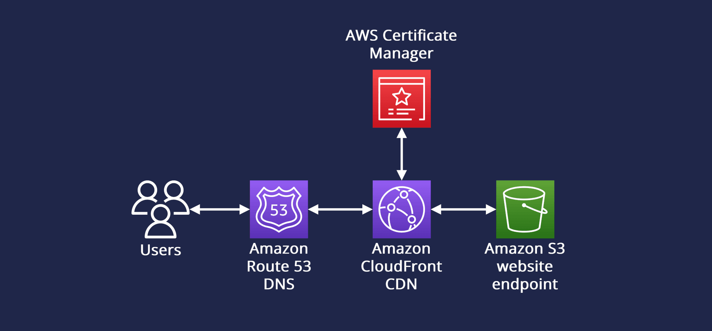
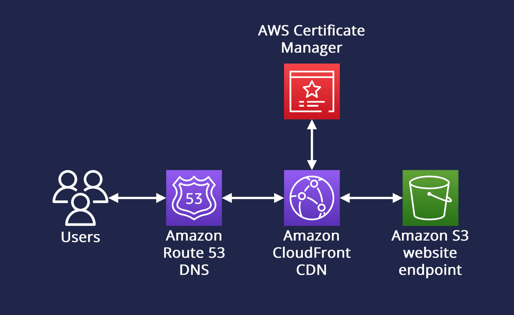

# my-cli-website
##Deployment Architecture

My "terminal/console" style personal website. Interact with the site while learning more about me by entering commands into the terminal UI. The website is built with HTML/CSS and Javascript using [jQuery](https://jquery.com).

Automated GitHub Actions CI workflow for AWS S3 deployment, utilizing CloudFront for efficient content delivery and AWS Certificate Manager for secure SSL certificates.

### Deployed @ https://sudodave.xyz

Enter `help` into the site to get a list of available commands to run!! :)


## Deployment Architecture 



## Usage

```
COMMANDS:
    echo TEXT - print txt to screen
    home - go back to beginning of site
    about - learn a little more about me
    skills - display my skills
    contact - get my contact details
    repo - get redirected to the repo
    clear - clear console screen

    projects - display personal projects
    help - display list of commands
```
