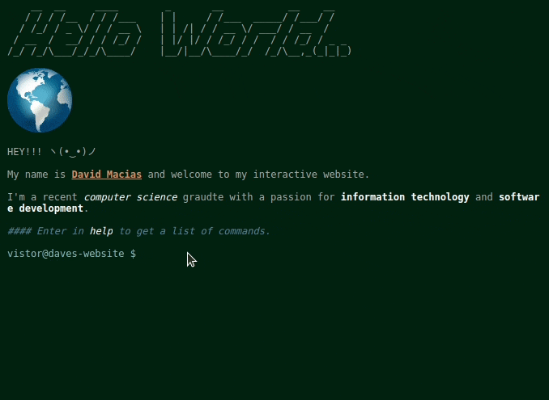

# my-cli-website

My "terminal/console" style personal website. Interact with the site while learning more about me by entering commands into the terminal UI. The website is built with HTML/CSS and Javascript using [jQuery](https://jquery.com).

Although I'm currenlty self-hosting an instance of this project with my home lab, I'm also hosting on github pages.

### Deploy @ https://sudo-dave.github.io/my-cli-website/


## Demo



## Usage

```
COMMANDS:
    echo TEXT - print txt to screen
    home - go back to beginning of site
    about - learn a little more about me
    skills - display my skills 
    contact - get my contact details
    resume - get redirected to my resume
    clear - clear console screen
    
    repo - get redirected to the repo
    help - display list of commands
```
